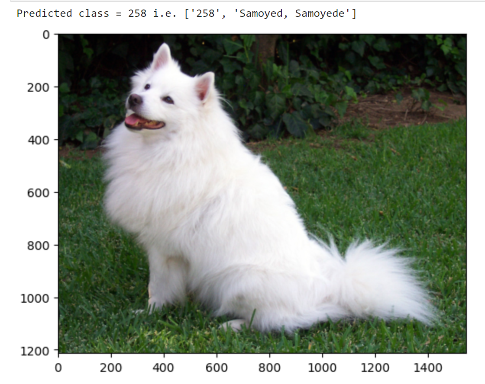

# Lab 4 Resnet
Follow the instruction in [Pytroch Resnet](https://pytorch.org/hub/pytorch_vision_resnet/)

### Generate the list of ImageNet classes
You can use this code to get the list of ImageNet classes
```python
def load_imagenet_classes():
    fp = open('/workpy/labs/ImageNet.txt')
    text = fp.read()
    fp.close()
    
    a = text.split('\n')
    lst = [i.split('\t') for i in a]
    return lst

inet = load_imagenet_classes()
```

### Compare predictions
Show the image and predicted classes (using `inet`). The output looks like this


### Explore
Download other images and try predict

## Construct your own Resnet
Write a small Resnet and train with ImageNet samples and test, follow the procedure in Lab 3, but the images are loaded from ImageNet.

Note that you should only use a small part of ImageNet, follow: [example](https://discuss.pytorch.org/t/how-to-get-a-part-of-datasets/82161). The whole ImageNet has 1.2 million images, and maybe takes 140GB disk space

### Data preparation
We will use STL-10, a subset of ImageNet. The images in this sub-set are all 96x96. So resize your Resnet accordingly. The data set has been downloaded. The snippet prepares the data set as well as the loader
```python
preprocess = transforms.Compose([
    transforms.Resize(96),
    transforms.CenterCrop(96),
    transforms.ToTensor(),
    transforms.Normalize(mean=[0.485, 0.456, 0.406], std=[0.229, 0.224, 0.225]),
])

# https://pytorch.org/vision/0.8/datasets.html#stl10
# https://cs.stanford.edu/~acoates/stl10/
# all images in STL-10 set are 96*96
trainset = torchvision.datasets.STL10('./stl10/', 'train', 
                                     download=True, transform = preprocess)

testset = torchvision.datasets.STL10('./stl10/', 'test', 
                                     download=True, transform = preprocess)

print('train size =', len(trainset), '; test size =', len(testset))

trainloader = torch.utils.data.DataLoader(
    trainset, batch_size = 32, shuffle = True)

valloader = torch.utils.data.DataLoader(
    testset, batch_size = 10, shuffle = True)
```

The snippet shows how to get the size of a data set and how to get a sub set (if you do not want to train or test on too many samples):
```python
# what the data set looks like
print(trainset[0])

# how many labels are in the set
s = {i[1] for i in trainset}
print('labels =', s)

# get a subset containing only labels [0, 3, 5]
targets = [0, 3, 5]
idx = [i for i, x in enumerate(trainset) if (x[1] in targets)];
strain = torch.utils.data.Subset(trainset, idx)
print('sub trainset size =', len(strain))
```

This snippet shows how to view a sample. It is basically a list containing 
1) tensor (image) and
2) label
    
```python
def normalize_for_plot(a):
    c0 = a.min(); c1 = a.max()
    a = (a - c0) / (c1 - c0)
    return a.permute(1, 2, 0);

k = 10
a = trainset[k][0]
print(a.shape)

b = normalize_for_plot(a)
plt.figure(figsize = (3, 3))
plt.imshow(b)
plt.axis('equal')
```


