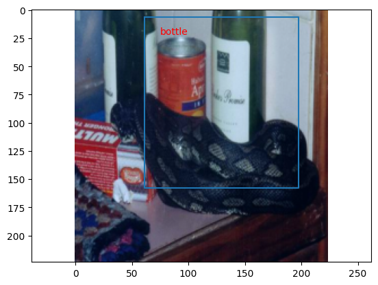

# Transfer learning and multi-task
[Ref](https://teaching.pages.centralesupelec.fr/deeplearning-lectures-build/01-pytorch-object-detection.html)

We will use Resnet-18 as a backbone, add several blocks to form a model that classifies and detects several objects in a picture.

The tasks:

1. Identify the main object (one of the 20 categories)
2. Find the bounding box of this main object: output $(x_0,y_0,x_1,y_1)$

## Data preparation
We will use [Pascal VOC data set](https://pytorch.org/vision/0.8/datasets.html#torchvision.datasets.VOCDetection)

### Load dataset
```python
# Pascal VOC data set
preprocess = transforms.Compose([
    transforms.Resize(size = (224, 224)),
    transforms.ToTensor(),
    transforms.Normalize(mean=[0.485, 0.456, 0.406], std=[0.229, 0.224, 0.225]),
])

trainset = torchvision.datasets.VOCDetection('/workpy/labs/voc', 
    year = '2010', image_set = 'train', download = True, transform = preprocess)

print('train size =', len(trainset))
```

Note that the images in Pascal VOC have various dimensions. Since Resnet-18 takes input images of $224\times 224$ pixels, we 
resize the image in preprocess.

### Data format
You can check the format of a sample:
```python
a = trainset[0]
print(a[0].shape)
print(a[1])
```
> torch.Size([3, 224, 224])
> 
> {'annotation': {'folder': 'VOC2010', 'filename': '2008_000008.jpg', 'source': {'database': 'The VOC2008 Database', 'annotation': 'PASCAL VOC2008', 'image': 'flickr'}, 'size': {'width': '500', 'height': '442', 'depth': '3'}, 'segmented': '0', 'object': [{'name': 'horse', 'pose': 'Left', 'truncated': '0', 'occluded': '1', 'bndbox': {'xmin': '53', 'ymin': '87', 'xmax': '471', 'ymax': '420'}, 'difficult': '0'}, {'name': 'person', 'pose': 'Unspecified', 'truncated': '1', 'occluded': '0', 'bndbox': {'xmin': '158', 'ymin': '44', 'xmax': '289', 'ymax': '167'}, 'difficult': '0'}]}}

The sample is a tuple. The 1st entry is an image and the 2nd one is the annotation in the form of a dictionary.

### Find all category names
```python
# get all the names in the Pascal trainset
cname = set()
for i in trainset:
    # i[0] is the image, i[1] is the annotation
    names, border = get_annotation(i[1])
    cname.update(names)
print(cname)

fp = open('/workpy/labs/voc/category.txt', 'w')
for i in cname:
    fp.write(i + '\n')
fp.close()
```

Then you can easily read the names from the text file:
```python
# get all the names in the Pascal trainset
cname = open('/workpy/labs/voc/category.txt').read().split('\n')
print(cname)

print(cname.index('cat'))
```

> ['horse', 'cat', 'car', 'chair', 'motorbike', 'cow', 'bottle', 'pottedplant', 'tvmonitor', 'aeroplane', 'sofa', 'sheep', 'bus', 'boat', 'bird', 'dog', 'train', 'bicycle', 'person', 'diningtable']
> 
> 1

There are 20 categories in Pascal VOC. 

### Extract object names and bounding boxes from annotations 
```python
# return all the names, bounding boxes,
# and the index of the major item (the one with
# the largest bounding box)
def get_annotation(a):
    sz = a['annotation']['size']
    width = float(sz['width'])
    height = float(sz['height'])
    
    lab = a['annotation']['object']
    names = []; borders = [];
    idx = 0; max_sz = 0
    cnt = 0
    for i in lab:
        names.append(i['name'])
        j = i['bndbox']
        x0 = float(j['xmin']) / width
        x1 = float(j['xmax']) / width
        y0 = float(j['ymin']) / height
        y1 = float(j['ymax']) / height
        borders.append([x0, y0, x1, y1])
        sz = (x1 - x0 + 1) * (y1 - y0 + 1)
        if sz > max_sz:
            max_sz = sz
            idx = cnt
        cnt+=1
    return names, borders, idx

# get the class index of a name
def get_index(cnames, name):
    return cnames.index(name);

# get all the names in the Pascal trainset
cname = open('/workpy/labs/voc/category.txt').read().split('\n')
print('names =', cname)
print('index of cat is', cname.index('cat'))
```
The bounding boxes are normalzied by the width ($x$) and height ($y$) of the image, so all
the 4 values are in $\left[ 0,1 \right]$

The 3rd returned value, `idx`, is the index of the major object, which has the largest
bounding box.

Test the extract method and see what the result looks like
```python
a = trainset[0]
p, q, r = get_annotation(a[1])
print('p =', p)
print('q =', q)
print('r =', r)
```

### Plotting function
```python
def normalize_for_plot(a):
    c0 = a.min(); c1 = a.max()
    a = (a - c0) / (c1 - c0)
    return a.permute(1, 2, 0);

def plot_tensor(x, names = None, borders = None, ax = plt):
    a = normalize_for_plot(x)
    ax.imshow(a)
    if names is not None:
        h = a.shape[0]
        w = a.shape[1]
        for i in range(len(borders)):
            text = names[i]
            bd = borders[i]
            x0 = bd[0] * w; y0 = bd[1] * h;
            x1 = bd[2] * w; y1 = bd[3] * h;
            ax.plot([x0, x1, x1, x0, x0], [y0, y0, y1, y1, y0])
            ax.text(x0 * 0.9 + x1 * 0.1, y0 * 0.9 + y1 * 0.1, text, color = 'red')
    
    ax.axis('equal')
    ax.axis('off')
```
Test the functions on one sample:
```python
k = 1
a = trainset[k]
sz = a[1]['annotation']['size']
lab = a[1]['annotation']['object']
print(sz, '\n------')
print(lab, '\n------')
for i in lab:
    print(i['name'], i['bndbox'])

nm, roi, idx = get_annotation(a[1])
for i in range(len(roi)):
    print(nm[i], roi[i])
print('largest = ', idx)

plot_tensor(a[0], nm, roi)
```

### Prepare data loader
```python
# convert the annotaion to three tensors
# => [images, labels, boxes]
def sample2tensors(samples):
    img_list = [i[0] for i in samples];
    lab_list = []; bbox_list = [];
    for i in samples:
        names, borders, idx = get_annotation(i[1]);
        lab = torch.tensor(get_index(cname, names[idx]), dtype=torch.int64)
        lab_list.append(lab)
        bd = torch.tensor(borders[idx])
        bbox_list.append(bd)
    images = torch.stack(img_list)
    labels = torch.stack(lab_list)
    bbox = torch.stack(bbox_list)
    return images, labels, bbox

trainloader = torch.utils.data.DataLoader(
    trainset, batch_size = 32, shuffle = True, collate_fn = sample2tensors)
```

A batch contains one or more tensors. E.g. one tensor contains the input images,
and the other tensor contains the corresponding labels. If the batch size is $B$ (e.g. $B=32$),
and the image size is $3\times 224\times 224$ (RGB channels, height 224, width 224), and the
label is an integer. Then the batch contains 2 tensors, one's shape is $[B,3,224,224]$, and the
other's shape is $[B]$.

For Pascal VOC, the labels are annotations, which must be converted to tensor form. The method 
`sample2tensors` converts a list of samples into 3 tensors: images, labels, and bounding boxes.

The data loader will pick up a random list of samples from the data set, and call this method 
(`collate_fn = sample2tensors`) to convert the list to three tensors.

The default `collate_fn` is `None`, which means the data loader will simply stack the sample entries
into tensors.


## Transfer learning
By Transfer Learning (TL), we take a pretrained model, keep most of the layers unchanged, remove the 
unwanted layers (usually the first or last couple of layers), and add our own layers. In training, 
we keep the pretrained layers unchanged, and only train our own layers.

In this work, we will add two separate modules (called **"heads"**) to Resnet-18 model. One is for 
classification, and the other is for regression (outputing the bounding box).

### Load Resnet-18 model
```python
# -- load pretrained Resnet-18 model
res18 = torch.hub.load('pytorch/vision:v0.10.0', 'resnet18', pretrained=True)
# or any of these variants
# model = torch.hub.load('pytorch/vision:v0.10.0', 'resnet34', pretrained=True)
# model = torch.hub.load('pytorch/vision:v0.10.0', 'resnet50', pretrained=True)
# model = torch.hub.load('pytorch/vision:v0.10.0', 'resnet101', pretrained=True)
# model = torch.hub.load('pytorch/vision:v0.10.0', 'resnet152', pretrained=True)
res18.eval()
```
### Define customized model
```python
# -- now ready for define classification and regression layer
import torch.nn.functional as F
import copy

class ResDet(nn.Module):
    def __init__(self):
        super(ResDet, self).__init__()
        self.fe = copy.deepcopy(nn.Sequential(*list(res18.children())[:-2]))
        # -- make sure these layers are not subject to change
        self.fe.requires_grad = False
        for p in self.fe.parameters():
            p.requires_grad = False
        # 
        # self.cat = nn.Conv2d(512, 21, 1, 1) # 512 channels => 21 channels

        # -- classification
        self.cat = nn.Linear(512 * 7 * 7, 21) # 512 channels => 21 channels

        # -- regression
        self.reg = nn.Sequential(
            nn.Dropout(0.5),
            nn.Flatten(1),
            nn.Linear(512*7*7, 1024),
            nn.ReLU(),
            # nn.BatchNorm1d(1024),
            nn.Dropout(0.5),
            nn.Linear(1024, 4),
            nn.Sigmoid()
        )

    # xb is a bacth of x_i, i.e., x1, x2, .., xn
    def forward(self, input):
        x = self.fe(input)
        y = self.cat(torch.flatten(x, 1))
        z = self.reg(x);
        # x = torch.flatten(x, start_dim = 1)
        return y, z
```
The line `self.fe = copy.deepcopy(nn.Sequential(*list(res18.children())[:-2]))` creates a deep copy of the Resnet-18 model
except for the last 2 layers. Without the deepcopy, `self.se` will be a reference to the loaded Resnet-18 model, thus 
any change to `self.se` will also impact the Resnet-18 instance.

Questions:

1. How do we tell Pytorch not to change the pretrained part?
2. What layers are the two heads? What do they do?
3. The model `ResDet` returns two tensors. What are their shapes?

You can take a look at the result of ResDet, and compare it with Resnet-18:
```python
rd = ResDet()
a, b = rd(input_batch)

print(input_batch.shape, a.shape, b.shape)
print('a =', a)
print('b =', b)

a = res18(input_batch)
print('c =', a.shape)
```

### Run a sample
This is what a sample image and its annotation looks like:
```python
k = 1
a = trainset[k]
sz = a[1]['annotation']['size']
lab = a[1]['annotation']['object']
print(sz, '\n------')
print(lab, '\n------')
for i in lab:
    print(i['name'], i['bndbox'])

nm, roi, idx = get_annotation(a[1])
for i in range(len(roi)):
    print(nm[i], roi[i])
print('largest = ', idx)

plot_tensor(a[0], nm, roi)
```
>{'width': '500', 'height': '327', 'depth': '3'}
>
>------
>
>[{'name': 'bottle', 'pose': 'Unspecified', 'truncated': '1', 'occluded': '1', 'bndbox': {'xmin': '270', 'ymin': '1', 'xmax': '378', 'ymax': '176'}, 'difficult': '0'}, {'name': 'bottle', 'pose': 'Unspecified', 'truncated': '1', 'occluded': '1', 'bndbox': {'xmin': '57', 'ymin': '1', 'xmax': '164', 'ymax': '150'}, 'difficult': '0'}] 
>
>------
>
>bottle {'xmin': '270', 'ymin': '1', 'xmax': '378', 'ymax': '176'}
>
>bottle {'xmin': '57', 'ymin': '1', 'xmax': '164', 'ymax': '150'}
>
>bottle [0.54, 0.0030581039755351682, 0.756, 0.5382262996941896]
>
>bottle [0.114, 0.0030581039755351682, 0.328, 0.45871559633027525]
>
>largest =  0

> 

This is the result of running this sample through a ResDet model:
```python
input_batch = a[0].unsqueeze(0)
p, q = rd(input_batch)
ps = p[0].tolist()
idx = ps.index(max(ps))
print(p, q)
bd = list(q.detach().numpy())
print(bd)
plot_tensor(input_batch[0], [cname[idx]], bd)
```

> tensor([[-88.9276, -12.7574, -23.5247, -52.9646,  35.9669, -94.3761, 191.4834,
          89.0961,  35.9469,   7.9138,  74.9024, -92.3355, -44.1593, -19.3539,
          31.6256,  41.5780,  68.8715,  39.2943, -71.7569, -61.9095, -46.1749]],
       grad_fn=<AddmmBackward0>) tensor([[0.2734, 0.0294, 0.8812, 0.7048]], grad_fn=<SigmoidBackward0>)
>
> [array([0.27340728, 0.0293836 , 0.8811949 , 0.70484483], dtype=float32)]

> > 
