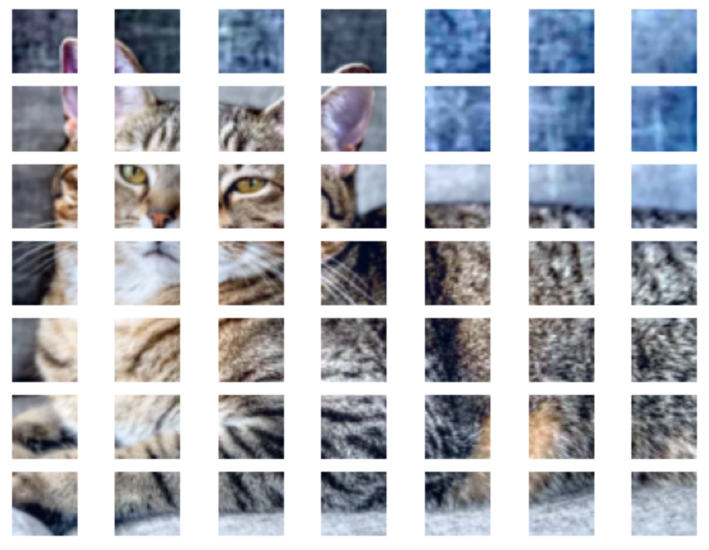

# LLM
## Ref
- [通向AGI之路：大型语言模型（LLM）技术精要](https://zhuanlan.zhihu.com/p/597586623)

**Introduction**
- [The Illustrated Transformer](http://jalammar.github.io/illustrated-transformer/)

**Transformer for NLP**
- [Pytorch transformer](https://pytorch.org/docs/stable/generated/torch.nn.Transformer.html?highlight=nn+transformer#torch.nn.Transformer)
  - [Word-level Language Modeling using RNN and Transformer](https://github.com/pytorch/examples/tree/main/word_language_model)
  - [LANGUAGE MODELING WITH NN.TRANSFORMER AND TORCHTEXT](https://pytorch.org/tutorials/beginner/transformer_tutorial.html)

- [基于transformers的自然语言处理(NLP)入门](https://datawhalechina.github.io/learn-nlp-with-transformers/#/./%E7%AF%87%E7%AB%A02-Transformer%E7%9B%B8%E5%85%B3%E5%8E%9F%E7%90%86/2.2-%E5%9B%BE%E8%A7%A3transformer?id=%e9%99%84%e5%8a%a0%e8%b5%84%e6%96%99)

**Transformer for vision**
- [What is YOLOv5? A Guide for Beginners](https://blog.roboflow.com/yolov5-improvements-and-evaluation/)

- [Vision Transformer and MLP-Mixer Architectures](https://github.com/google-research/vision_transformer)
  
- [MViTv2: Improved Multiscale Vision Transformers for Classification and Detection](https://github.com/facebookresearch/mvit)
  
- [NYU Depth Dataset V2](https://cs.nyu.edu/~silberman/datasets/nyu_depth_v2.html)

- [The PASCAL Visual Object Classes](http://host.robots.ox.ac.uk/pascal/VOC/index.html)

**Spiking Neural Network (SNN)**

- [脉冲神经网络 (Spiking Neural Network) 解读 (一)](https://zhuanlan.zhihu.com/p/416187474)

- [SpikingJelly: 训练大规模SNN](https://spikingjelly.readthedocs.io/zh_CN/latest/activation_based/train_large_scale_snn.html#activation-based-model)

- [Spikformer: When Spiking Neural Network Meets Transformer, ICLR 2023](https://github.com/ZK-Zhou/spikformer/tree/main)

## Multitask ViT (Vision Transformer)
Later we will replace the transformer by Spikformer. First, let's focus on 2 tasks:
image classification and segmentation. The structure is a transformer followed by 2 heads:
a FC for classification and a FC for segmentation.

The input image is $224\times 224$, divided into $7\times 7$ patches. The embedding of a patch
is given by Resnet-18, which converts the whole image into $512\times 7 \times 7$.
The embedding of each patch then has a dimension of 512.

### image utilities
Build a utility py script, named "pascal_voc":

```python
import numpy as np
import torch
import torchvision
import matplotlib.pyplot as plt
from time import time
from torchvision import datasets, transforms
from torch import nn, optim

from PIL import Image
from torchvision import transforms

import torch.nn.functional as F
import copy

from scipy.io import loadmat
from nn.pascal_voc import *
```

Usage:
```python
x = Image.open('test/cat.jpg')
a = Voc.preprocess(x)
print(a.shape)

plt.figure()
Voc.plot_tensor(a)
```

### ViT model
```python
# -- use CFAR-100-trained Resnet32 as front-end
# Model	Top-1 Acc.(%)	Top-5 Acc.(%)	#Params.(M)	#MAdds(M)
# resnet32	70.16	90.89	0.47	69.13
# https://github.com/chenyaofo/pytorch-cifar-models
from zoo.resnet import *

res32 = cifar100_resnet32()
res32.load_state_dict(torch.load
                      ('zoo/cifar100_resnet32-84213ce6.pt'))    
res32.eval()

# -- the transformer
tf = nn.Transformer(d_model = 256, nhead = 8, batch_first = True)

class TFDet(nn.Module):
    def __init__(self, categories = 460):
        super(TFDet, self).__init__()
        self.fe = copy.deepcopy(nn.Sequential(*list(res32.children())[:-2]))
        self.ff = nn.AdaptiveAvgPool2d(output_size=(2, 2))
        self.te = copy.deepcopy(list(tf.children())[0])
        
        # -- make sure these layers are not subject to change
        Voc.freeze(self.fe)
        Voc.freeze(self.ff)
        
        # -- classification, pascal context has 460 labels, including 
        # 0: empty and 431: unknown
        self.cat = nn.Linear(256, categories) 
        # each 32*32 patch indicates at most 4 categories. The user is supposed to
        # merge nearby patches with ther same categories
        # use topk to get them

        # -- segmentation
        self.reg = nn.Sequential(
            nn.Dropout(0.5),
            # nn.Flatten(1),
            nn.Linear(256, 1024),
            nn.ReLU(),
            # nn.BatchNorm1d(1024),
            nn.Dropout(0.5),
            nn.Linear(1024, 1024*4), # at most 4 categories per patch
            nn.Sigmoid()
        )

        # which device this model is in
        self.dev = 'cpu'

    # xb is a bacth of x_i, i.e., x1, x2, .., xn
    def forward(self, input):
        x = self.fe(input)
        x = self.ff(x)
        x = torch.flatten(x, 1)
        x = self.te(x)
        
        y = self.cat(x)
        z = self.reg(x);
        z = z.reshape((z.shape[0], 1024, 4))

        return y, z

    # convert (cat, reg) to segmentation
    def toSegment(self, y, z):
        # -- select the top 4 of y
        num = z.shape[0]
        u = torch.zeros(num, 1024, 460).to(self.dev)
        val, ind = torch.topk(y, 4)
        # u[:, :, ind] = z[:, :, :]
        for i in range(num):
            for j in range(1024):
                u[i, j, ind[i, :]] = z[i, j, :]
        
        return u
```

Example of using Resnet-32 model:
```python
# print(len(resnet32.children()))
x = Image.open('test/cat.jpg')
a = Voc.cfar_preprocess(x).unsqueeze(0)
print(a.shape)
b = res32(a)
print(b.shape)
b = F.softmax(b, dim = 1)
print(torch.max(b), torch.argmax(b))
print('it is ---', cifar_100_names[torch.argmax(b)])
```

> torch.Size([1, 3, 32, 32])
> 
> torch.Size([1, 100])
>
> tensor(0.8406, grad_fn=<MaxBackward1>) tensor(42)
>
> it is --- leopard

### transformer backbone
The idea is to divide an image into $32\times 32$ patches. 

```python
# divide the image into 32x32 patches, at dimension 1 and 2
print(a.shape)
b = a.unfold(1, 32, 32).unfold(2, 32, 32)
b = b.flatten(1, 2) # combine dim 1 and 2, (3, 7, 7, 32, 32) => (3, 49, 32, 32)
b = b.permute(1, 0, 2, 3)
print(b.shape)

fig, ax = plt.subplots(7, 7)
for i in range(0, 7):
    for j in range(0, 7):
        Voc.plot_tensor(b[i*7 + j,:, :,:], ax = ax[i, j])
```

> torch.Size([3, 224, 224])
> 
> torch.Size([49, 3, 32, 32])
>
> 
